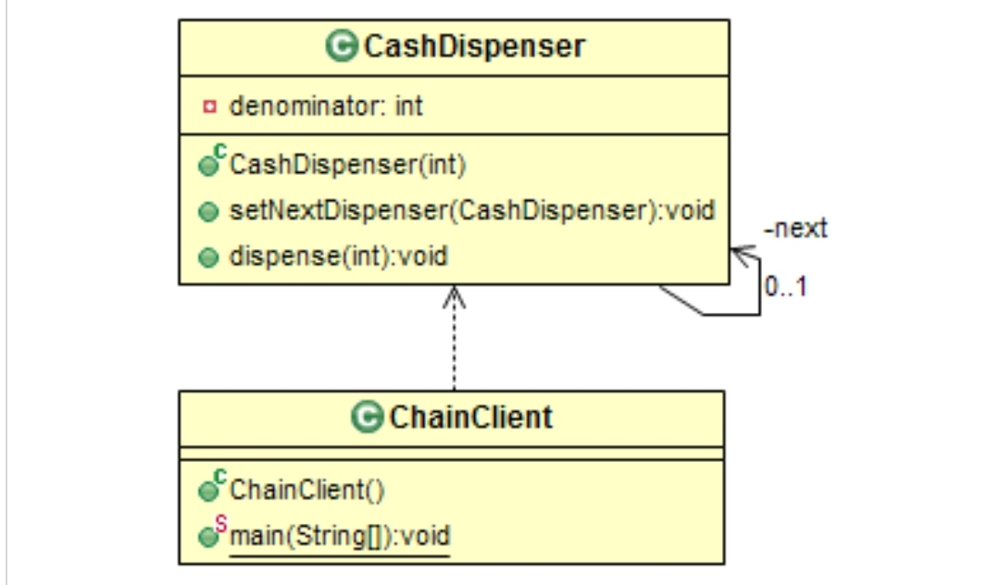

# Behavioral: Chain of Responsability
### Intent

Avoid coupling the sender of a request to its receiver by giving more than one object a chance to handle the request. Chain the receiving objects and pass the request along the chain until an object handles it.

---
### When to use

* When a request needs to be processed by multiple processors.
* To achieve loose coupling between sender and receivers.

---
### Structure

---
### Benefits

* Client does not need to know about all the processors. It sends the request to the first processor in the chain (launch and leave).
* Unlike the Decorator pattern, the chain can be broken at any point to prevent other processor from handling the request.

---
### Drawbacks

* Since there is no explicit hander/receiver for the request, there is a possibility that the request remains unprocessed.
* Incorrectly configured chain may cause some requests to be skipped.

---
### Real world Examples

* Escalation Matrix.
* Reimbursement Approval Hierarchy.

---
### Software Examples

* Windows Event Handler - Events are propagated until gets processed
* Exception Handling - Exceptions are re-thrown if the handler is incapable of handling it.

--- 
### Java SDK Examples

* java.util.logging.Logger.log()
* javax.servlet.Filter.doFilter()
