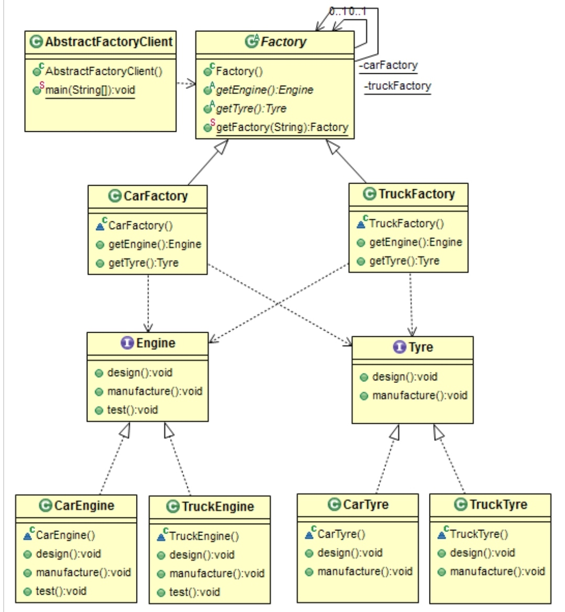

# Creational: Abstract factory
### Intent

Provide an interface for creating families of related or dependent objects without specifying their concrete classes.

---
### When to use

* To support families of related or dependent objects.
* To encapsulate platform dependencies to male an application portable.
* To prevent client code from using the "new" operator.
* To easily swap the underlying platform with minimal changes.

---
### Components

1. An abstract factory class, public, to return the factory.
2. Factory implementations for various familes (private inside the package).
3. Interface of various products, public, to get implementation from the factories.
4. Set of product implementations for various families (private inside the package).

---
### Structure

---
### Benefits

* Loosely coupled code.
* Abstract Factory provides a single point of access for all products in a family.
* new product family can be easily supported.

---
### Drawbacks

* More layers of abstraction increases complexity.
* If there are any changes to any underlying details of one factory, the interface might need to be modified for all factories.

---
### Real world Examples

* providing data access to two different data sources (e.g a SQL Database and a XML file). You have two different data access classes (a gateway to the datastore).
Both inherit from a base class that defines the common methods to be implemented (e.g. load, save, delete). Which data source shall be used shouldn't change the way client
code retrieves it's data access class. Your abstract Factory knows which data source shall be used and returns an appropriate instante on request. The factory returns 
this instance as the base class type.

---
### Software Examples

* Dependency Injection

--- 
### Java SDK Examples

* javax.xml.parsers.DocumentBuilderFactory.newInstance();
* javax.xml.transform.TransformFactory.newInstance();
* javax.xml.xpath.XPathFactory.newInstance();
