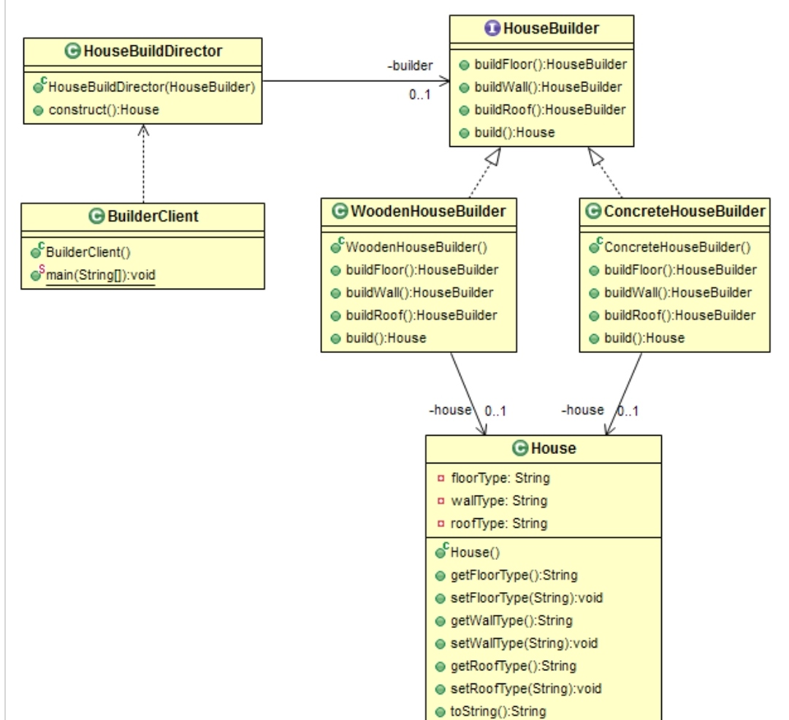

# Creational: Builder
### Intent

Separate the construction of a complex object from its representation so that the same construction process can create different representations.

---
### When to use

* To avoid dealing with inconsistent object when the object to be created over several steps.
* To aoid too many constructor arguments.
* To construct an object that should be immutable.
* To encapsulate the complete creation logic.

---
### Components

1. The builder class specifies an abstract interface for creating parts of a Product object.
2. The ConcreteBuilder constructs and puts together parts of the product by implementing the Builder interface. It defines and keeps track of the representation it creates and provides an interface for saving the product.
3. The Director class constructs the complex object using the Builder interface.
4. The Product represents the complex object that is being built.

---
### Structure

---
### Benefits

* Construction process can be controlled by the director.
* Useful when many operations have to be done to build an object.
* Avoids Telescoping Constructor Pattern.

---
### Drawbacks

* Not suitable if a mutable object is required.

---
### Real world Examples

* Building a house. we need to tell the architect what all we want as part of the building. The Architect then designs and constructs the building. It will be 
handed over only when everything is implemented. We do not get a partially built house (which in unsafe).

--- 
### Java SDK Examples

* java.lang.StringBuilder.append();
* java.lang.StringBuffer.append();
* java.nio.ByteBuffer.put();
* javax.swing.GroupLayout.Group.addComponent();
