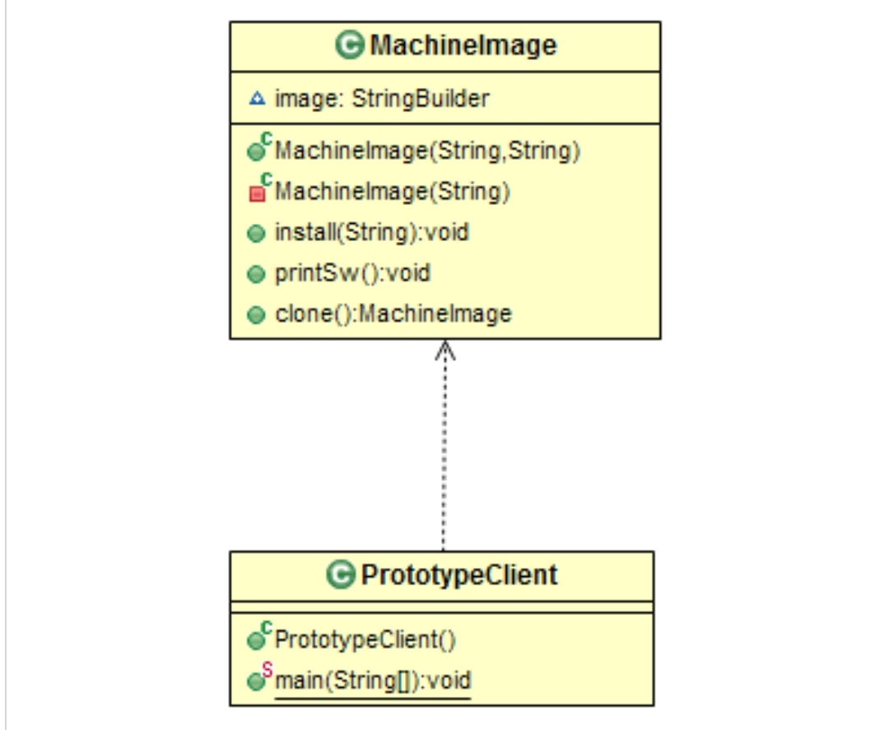

# Creational: Prototype
### Intent

Specify the kinds of objects to create using a prototupical instance and create new objects copying this prototype.

---
### When to use

* To improve the performance when object creation is costly and time consuming.
* To simplify and optimize multiple objects creation that will have mostly the same data.

---
### Components

1. A class that implements <strong>Cloneable</strong> interface (public).

---
### Structure

---
### Benefits

* Performance: Cloning (using MemberwiseClone) is considerably less expenseve than creating a new object afresh (with new operator).
* Objects can be cloned very dynamically, without any instance on up-front instantiation. The first created object can be created at any time in the application
execution, and further duplication can take place at any time ahead.

---
### Drawbacks

* Deep copy has to be handled carefully.

---
### Real world Examples

* Biological Cell splitting.

---
### Software Examples

* Virtual Machine images. Have one image per OS which has all the required S/W installed.
* DVD duplication. Duplication of the master dbd to create several copies.

--- 
### Java SDK Examples

* java.lang.Object.clone();
