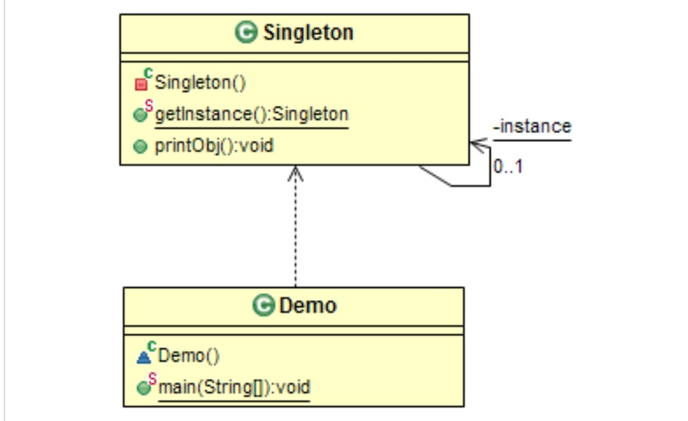

# Creational: Singleton
### Intent

Ensure a class has only one instance, and provide a global point of access to it.

---
### When to use

* Application needs "only one instance" of a class.
* To have complete control over the instance creation.

---
### Components

1. Singleton class.

---
### Structure

---
### Benefits

* Controlled instantiation.
* Supports boh EAGER and LAZY initialization.
* Singletons can be converted to Multitions (to support limited number of instances identified by keys).

---
### Drawbacks

* Singleton is often seen as "not-so-good" design as it resembles global variables.
* Special handling is required if the Singleton object needs to be deleted.
* singletons that maintain global state may cause issues.

---
### Real world Examples

* The office of the President (there can be only one President at any given time).

---
### Software Examples

* Logger classes
* Window manager
* Printer Spooler

--- 
### Java SDK Examples

* java.lang.Runtime.getRuntime();
* java.awt.Toolkit.getDefaultToolkit();
* java.awt.Desktop.getDesktop();
* java.util.logging.LogManager.getLogManager();
* java.lang.System.getSecurityManager();
