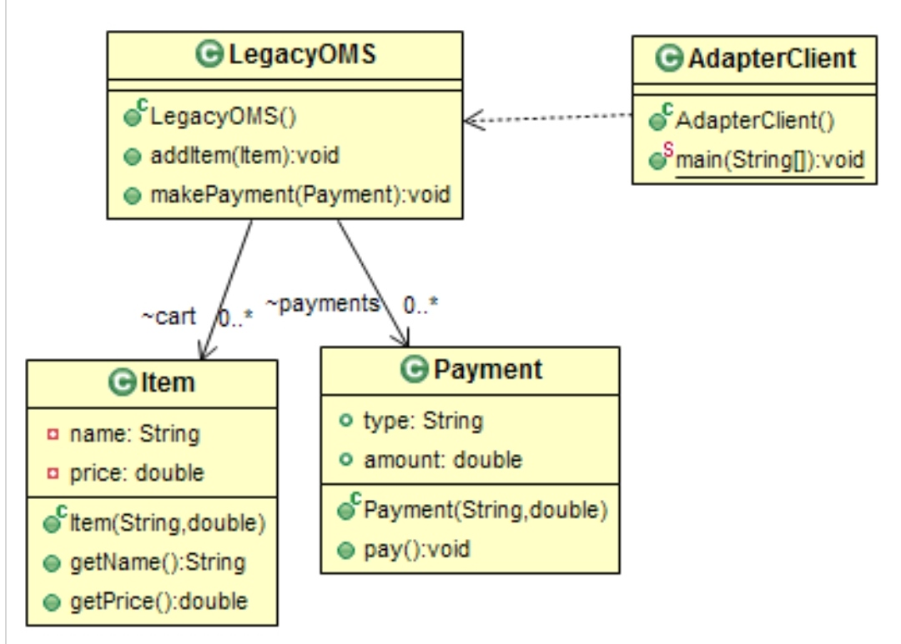
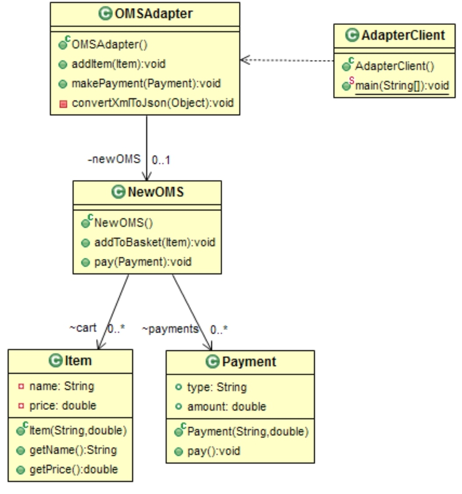

# Structural: Adapter
### Intent

Convert the interface of a class into another interface clients expect. Adapter lets classes work together that couldn't otherwise because of incompatible interfaces.

---
### When to use

* To wrap an existing class with a new interface.
* To pergorm impedance matching.

---
### Components

1. Target - defines the domain-specific interface that client uses.
2. Adapter - adapts the interface Adaptee to the Target interface.
3. Adaptee - defines an existing interface that needs adapting.
4. Client - collaborates with objects conforming to the Target interface.

---
### Structure

Before:  

After:  

---
### Benefits

* Class adapter can override adaptee's behavior.
* Objects adapter allows a single adapter to work with many adapters.
* Helps achieve reusability and flexibility.
* Client class is not complicated by having to use a different interface and can use polymorphism to swap between different implementations of adapters.

---
### Drawbacks

* Object adapter involves an extra level of indirection.

---
### Real world Examples

* Power adapters.
* Memory card adapters.

---
### Software Examples

* wrappers used to adopt 3rd parties libraries and frameworks.

--- 
### Java SDK Examples

* java.util.Arrays.asList();
* java.util.Collections.list();
* java.util.Collections.enumeration();
* java.io.InputStreamReader(InputStream) (returns a Reader);
* java.io.OutputStreamReader(OutputStream) (returns a Writer);
