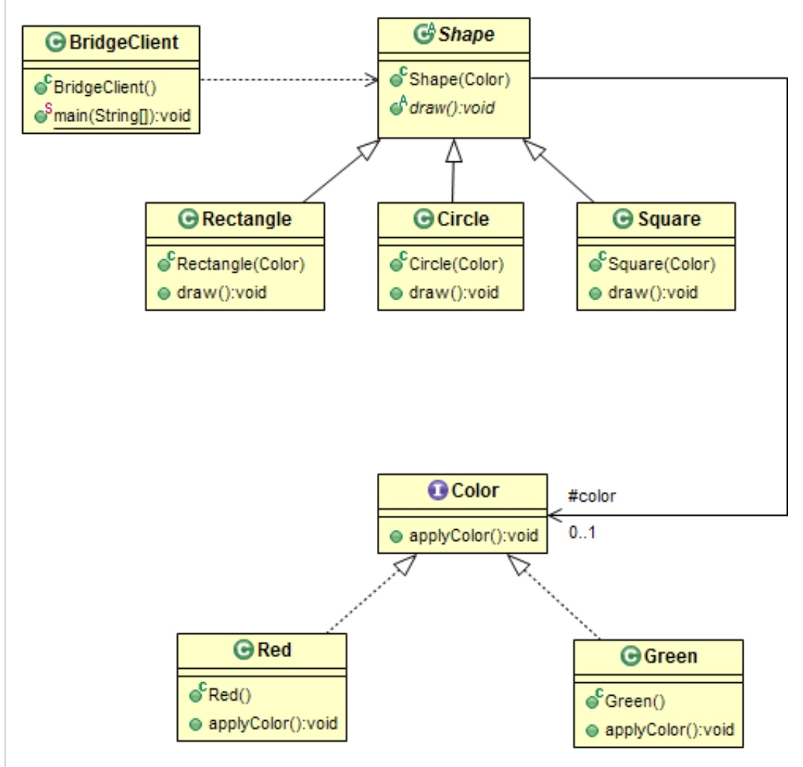

# Structural: Bridge
### Intent

Decouple an abstraction from its implementation so that the two can vary indenpendently.

---
### When to use

* When run-time binding of the implementation is required.
* To support a proliferation of classes resulting from a coupled interface and numerous implementations.
* To share an implementation among multiple objects and to map orthogonal class hierarchies.

---
### Structure

---
### Benefits

* Decoupling allows us to choose the implementations at runtime.
* Compile-time dependencies on the implementation are eliminated.
* Improved extensibility and flexibility.

---
### Drawbacks

* The delegation from the Entities to the Behaviors can degrade performance.

---
### Real world Examples

* The display of differente image formats on different operating systems is a good example of the Bridge pattern. You might have different image abstractions for both
jpeg and png images. The image structure is the same across all operating systems, but the how it's viewed (the implementation) is different on each OS. This is
the type of decoupling that the Bridge pattern allows.

---
### Software Examples

* UnifiedPOS or UPOS that provides vendor-neutral APIs for numerous Point of Sale peripherals.
* OS specific Device Driver interfaces that define common standards for various devices.
