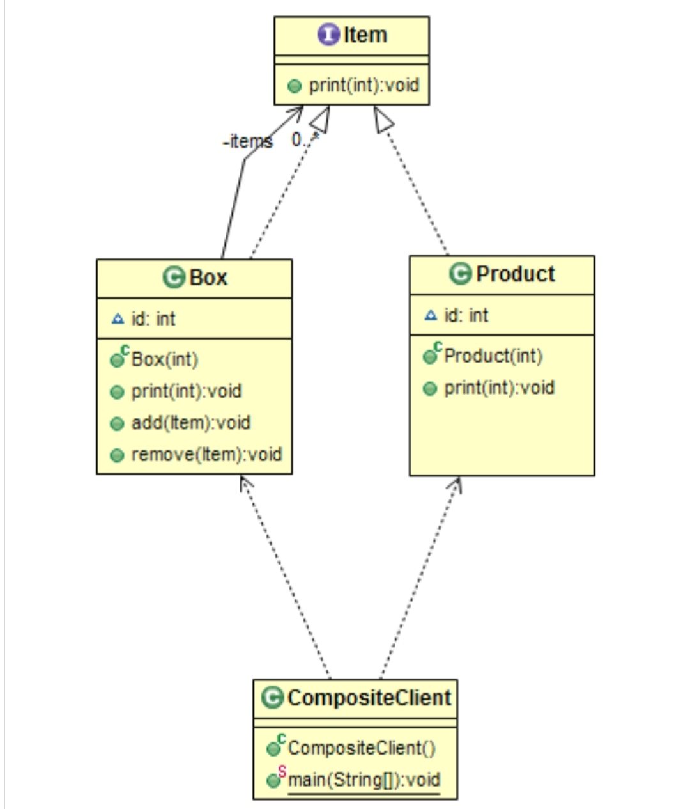

# Structural: Composite
### Intent

Compose objects into tree structures to represent part-whole hierarchies. Composite lets clients treat individual objects and compositions of objects uniformly.

---
### When to use

* To have a hierarchial cllection of primitive and composite entities.
* To create a structure in a way that the objects in the structure can be treated the same way.

---
### Structure

---
### Components

1. An interface for all objects in the composition.
2. A leaf element which is the building block of the composition.
3. A composite element which can contain leaf elements and/or composites.

---
### Benefits

* simplifies the representation of part-whole hiearchies.
* Clients can treat all objects in the composite structure uniformly.

---
### Drawbacks

* Strict restrictions need to be enforced otherwise the tree structure way become overly generalized.

---
### Real world Examples

* Organization structure with manager and reportees. The reportees could be managers who may have their own reportees.

---
### Software Examples

* File System (directories and files).

--- 
### Java SDK Examples

* java.awt.Container.add(Component);
* javax.faces.component.UIComponent.getChildren();
