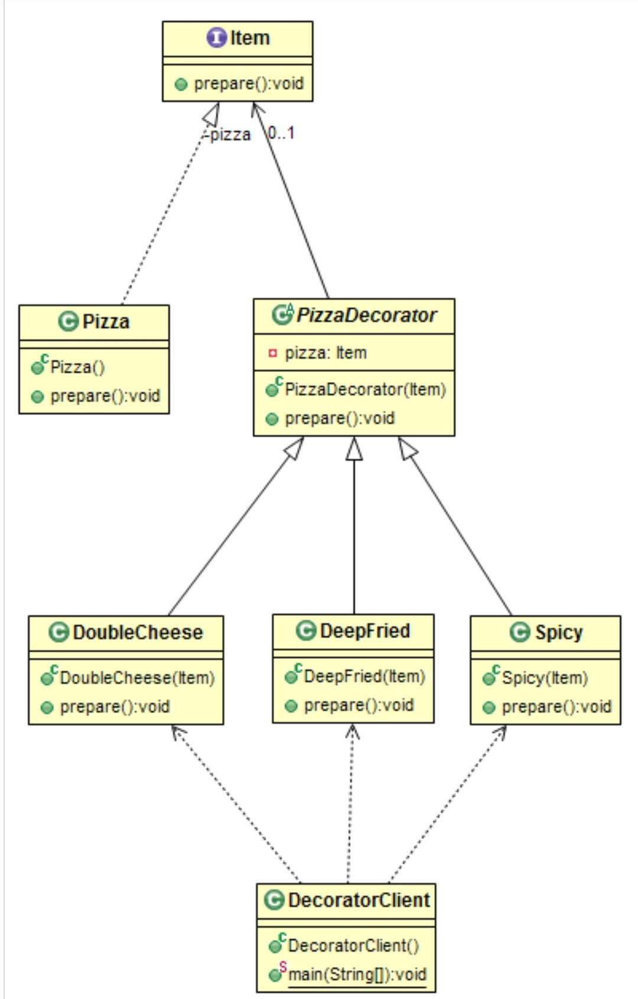

# Structural: Decorator
### Intent

Attach additional responsibilities to an object dynamically. Decorators provide a flexible alternative to subclassing for extending functionality.

---
### When to use

* To dinamically change the functionality of an object at runtime without impacting the existing funcionality of the objects.
* To add functionalities that may be withdrwan later.
* To combine multiple funcionalities where it is impractical to create a subclass for every possible combination.

---
### Example

Assume that you need to prepare a pizza that may have multiple combinations of toppings, cooking type, etc. Though this can be achieved by Enheritance, it is not 
practical to create subclasses for every possible combination. alternatively you can use Composition and add the requered functionalities. Since all concrete implementations conform to the same interface, we can mix and match any number of classes to create a variety of combinations.

---
### Structure

---
### Benefits

* Decorator allows us to mix and match features instead of creating concrete implementations for all possible combinations.
* Decorator allows us to modify an object in a much more modular and less fundamental way than inheritance would.
* New functionalities can be easily supported.

---
### Drawbacks

* Multiple small objects are created in the process of creating an object.
* Complexity is increased.

---
### Programming Examples

* File Stream implementations.

--- 
### Java SDK Examples

* All subclasses of java.io.InputStream, OutputStream, Reader and Writer have a constructor taking an instance of same type.
* java.util.Collections, the checked(), synchronized and unmodifiable methods;
* javax.servlet.http.HttpSerbletRequestWrapper and HttpSerbletResponseWrapper.
