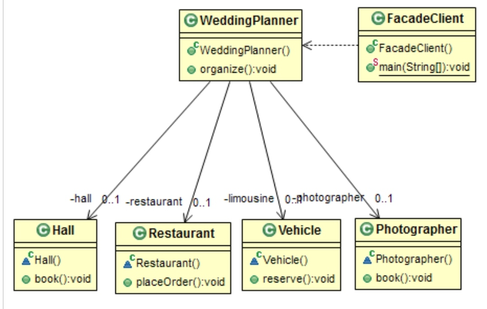

# Structural: Facade
### Intent

Provide a unified interface to a set of interfaces in a subsystem. Facade defines a higher-level interface that makes the subsystem easier to use.

---
### When to use

* To provide a simplified interface to the overall funcionality of a complex subsystem.
* To promote subsystem independence and portability.

---
### Example

Assume that we have set of interfaces for a system that includes many subsystems. The clinet application can use these interfaces to perform the required operation. But when the complexity increases, client application will find it difficult to manage it. By using the Facade pattern, we can hide the complexities of the system and provide an interface to the client using which the client can access the system.

---
### Structure

---
### Benefits

* number of objects the client interact with is minimal which reduces the compilantion complexity.
* Promotes loose coupling.
* Facade still allows the client to use the subsystem interfaces.

---
### Drawbacks

* One more layer is introduced in the system which way impact the performance.

---
### Real world Examples

* Customer support Desk which hides all complexities of the system that involves arious departments.
* Event Planner who does everything including like making reservatinons, organizing activities, etc.

---
### Java SDK Examples

* javax.faces.context.FacesContext, it internally uses among others the abstract/interface types Lifeycle, ViewHandler, NavigationHandler and many more without that the enduser has.
* javax.faces.context.ExternalContext, which internally uses ServletContext, HttpSession, HttpServletRequest, HttpServletResponse, etc.
