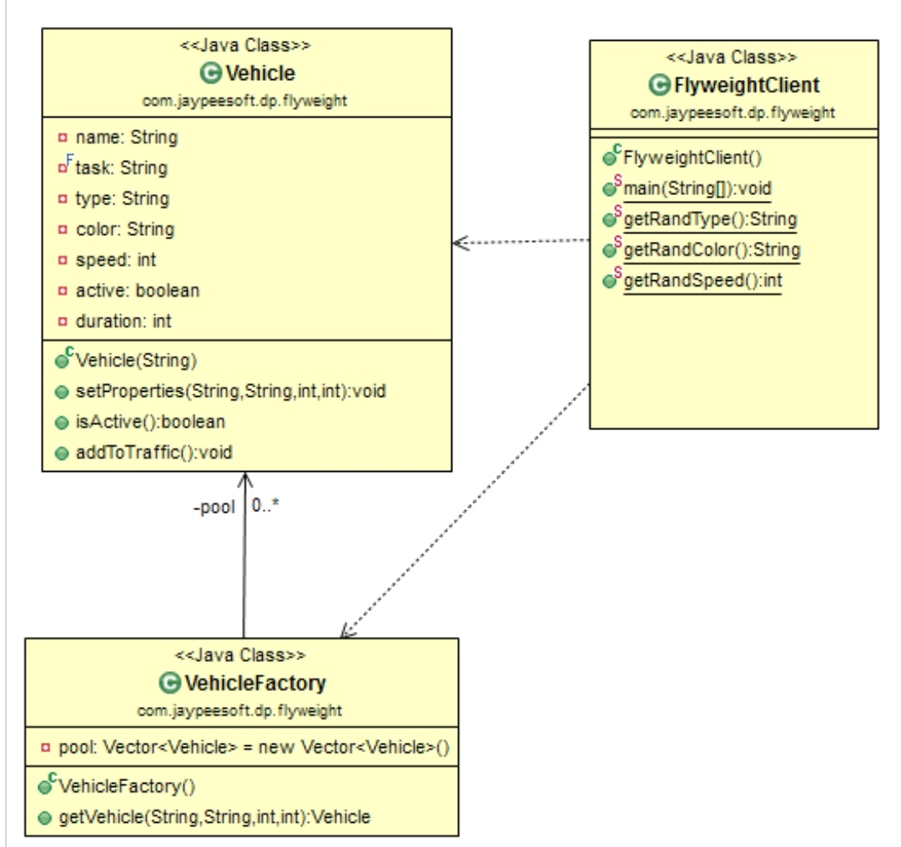

# Structural: Flyweight
### Intent

Use sharing to support large numbers of fine-grained objects efficiently.

---
### When to use

* To improve the performance when large number of objects to be created.

---
### Structure

---
### Benefits

* The total number of instances can be reduced.
* objects sharing reduces the total memory used.

---
### Drawbacks

* May introduce run-time costs associated with transferring, finding, and/or computing extrinsic state, specially if it was formerly stored as intrinsic state.

---
### Java SDK Examples

* java.lang.Integer.valueOf(int) (also on Boolean, Byte, Character, Short, long and BigDecimal).
