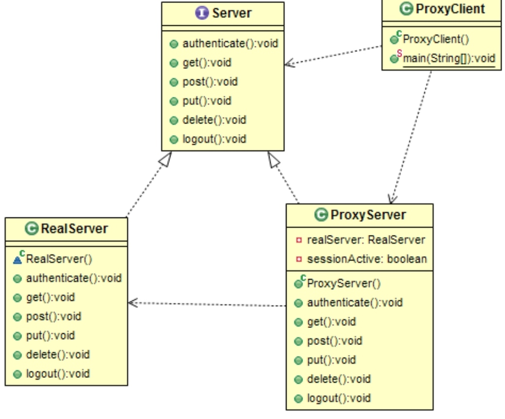

# Structural: Proxy
### Intent

Provide a surrogate or placeholder for another object to control access to it.

---
### When to use

* To provide controlled access to a sensitive master object
* To provide a local reference to a remote object
* To improve performance when an object needs to be accessed frequently

---
### Example

Let us see the example of a Proxy Server. A proxy server, also know as a "proxy" or "application-level gateway", is a computer that acts as a gateway between a local network (e.g. all the computers at one company or in one building) and a larger-scale network such as the internet. Proxy server can act as an intermediary between the user's computer and the internet prevent from attack and unexpected access.

A proxy server will behave just like the real server and implements the same interface.

---
### Structure

---
### Benefits

* A proxy can mask the life-cycle and state of a volatile resource from its client.
* Easey to manage the access to the real subject.
* Proxies can help in creating objects on-demand.

---
### Drawbacks

* Performance may be impacted due to the extra level of indirection. 

---
### Real world Examples

* Agents with Power of Attorney.
* Representatives/Brokers

---
### Software Examples

* SSH client

--- 
### Java SDK Examples

* java.lang.reflect.Proxy;
* java.rmi.*;
* javax.ejb.EJB;
* javax.inject.inject;
* javax.persistence.PersistenceContext;
